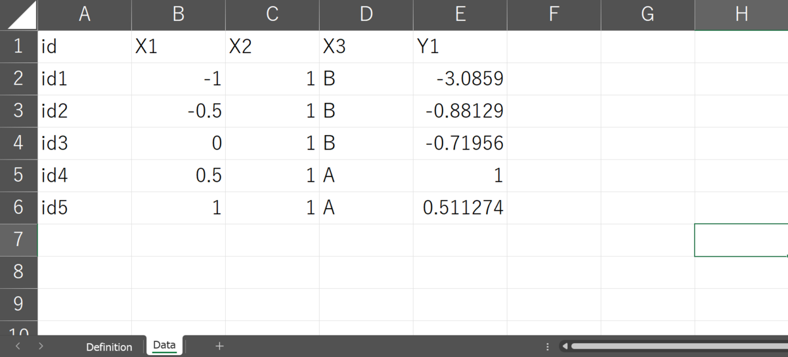
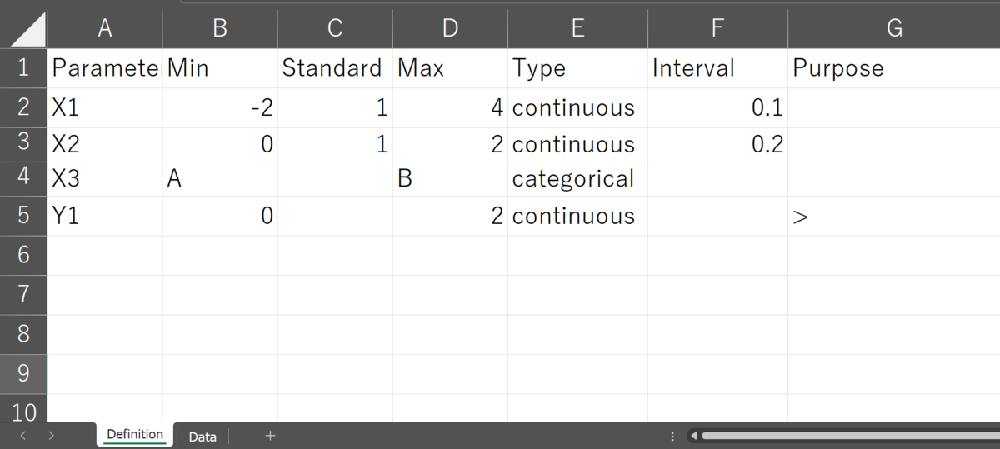
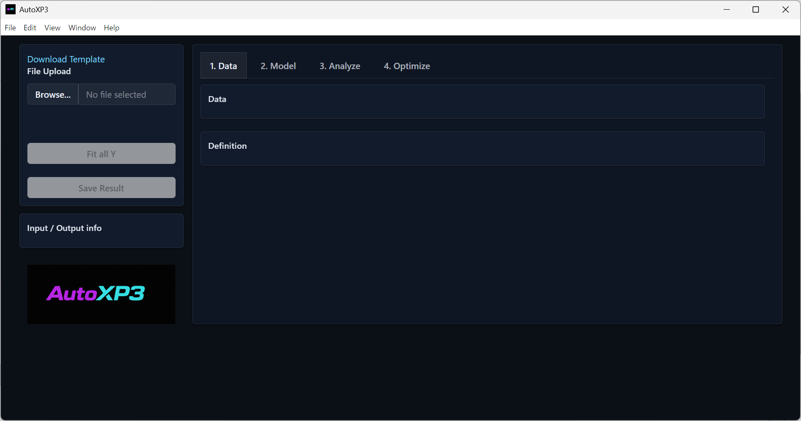
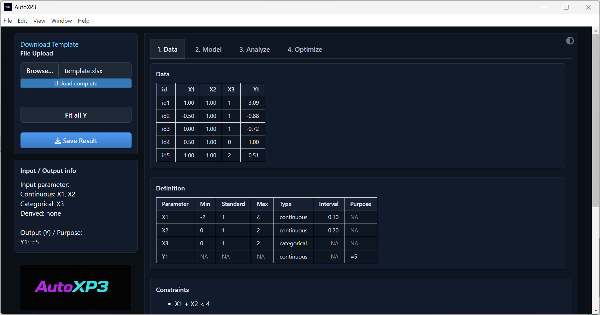
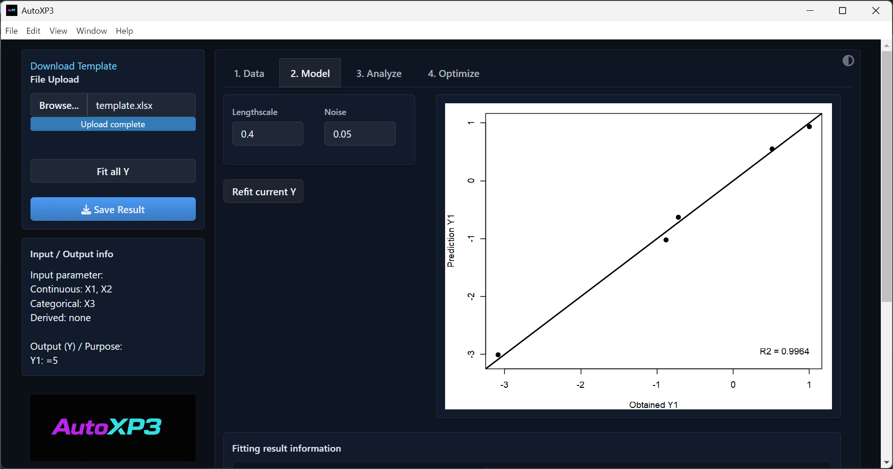
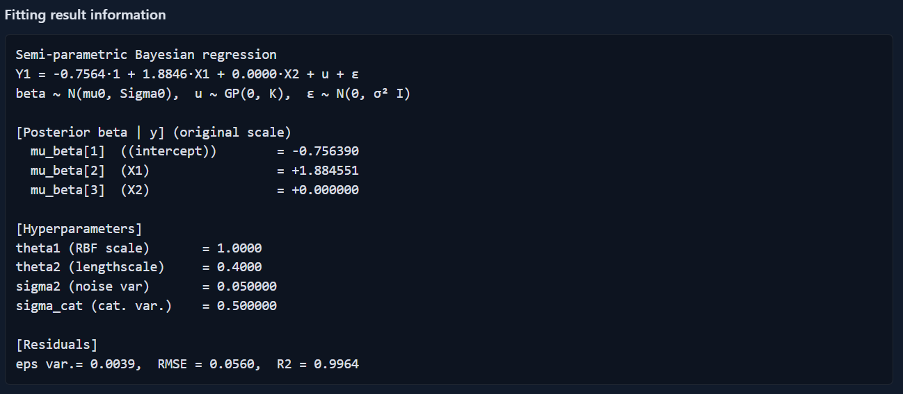
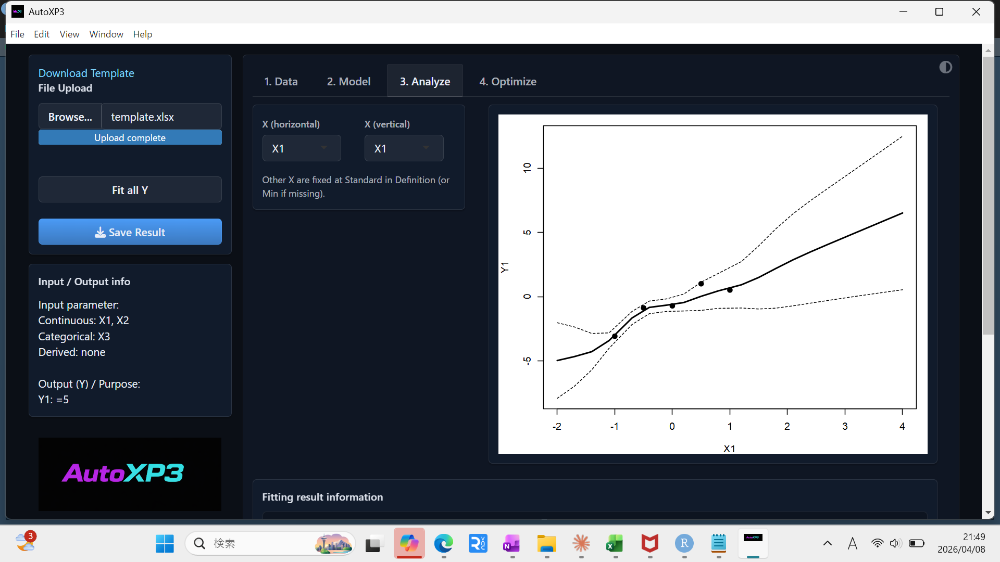
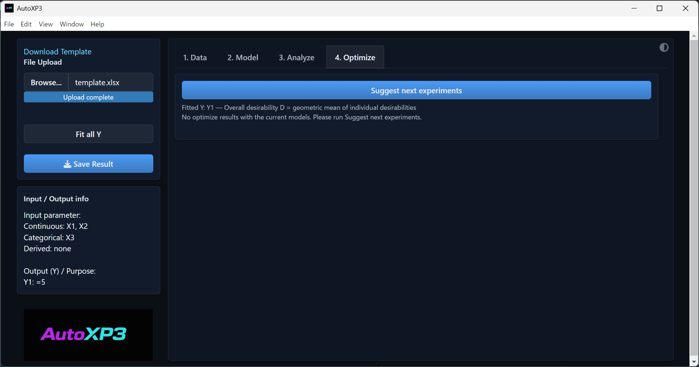
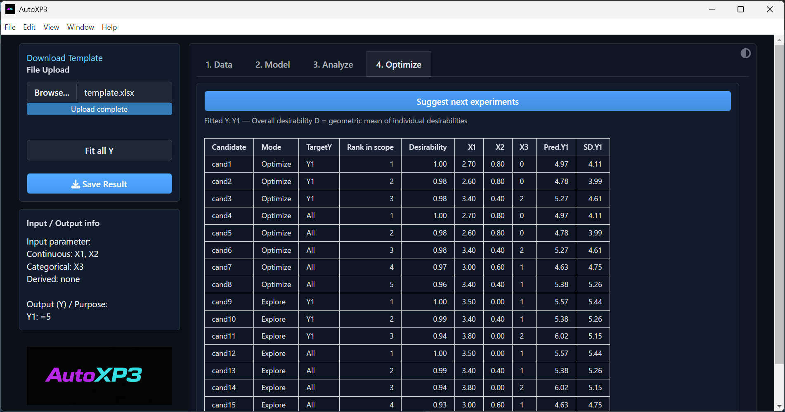
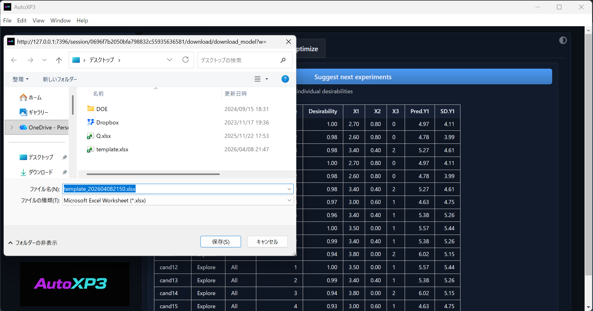

# AutoXP3 User Manual

**Experimental Design Support Tool Based on Semi-parametric Bayesian Regression and Bayesian Optimization**

---

## Table of Contents

- [Core Files](#core-files)
- [Installation](#installation)
- [1. What is AutoXP3?](#1-what-is-autoxp3)
- [2. Preparing the Excel Template](#2-preparing-the-excel-template)
- [3. Uploading Data (1. Data Tab)](#3-uploading-data-1-data-tab)
- [4. Fitting the Model (2. Model Tab)](#4-fitting-the-model-2-model-tab)
- [5. Visualizing Predictions (3. Analyze Tab)](#5-visualizing-predictions-3-analyze-tab)
- [6. Suggesting Next Experiments (4. Optimize Tab)](#6-suggesting-next-experiments-4-optimize-tab)
- [7. Saving Results](#7-saving-results)
- [8. Reproducing Results Without the App](#8-reproducing-results-without-the-app)

---

## Core Files

| Path | Description |
|---|---|
| `myapp/` | Full R Shiny application source (server, UI, Excel template) |
| `myapp/R/` | Semi-parametric Bayesian regression core (GP kernel, UCB, standardization, validation) |
| `REPRODUCTION_PROMPT.md` | Machine-readable prompt for AI to reproduce the full pipeline without the app |
| `readme-ja.md` | Japanese user manual |

---

## Installation

### Option A — Browser (no R required)

Open the link below — no installation needed:

**https://long-rh.github.io/AutoXP3-shinylive/**

R runs entirely in the browser via WebAssembly (Shinylive). 

### Option B — Run locally

#### Step 1 — Install R (skip if R ≥ 4.1 is already installed)

Download and run the installer for your OS from the official CRAN site:

| OS | Installer |
|---|---|
| Windows | https://cran.r-project.org/bin/windows/base/ |
| macOS | https://cran.r-project.org/bin/macosx/ |
| Linux | https://cran.r-project.org/bin/linux/ |

This is a standard system installation. Package isolation is handled by `renv` in the next step, so there is no risk of conflicting with packages used by other R projects on the same machine.

#### Step 2 — Clone and set up

```bash
git clone https://github.com/long-rh/AutoXP3-shinylive
cd AutoXP3-shinylive/myapp
Rscript setup.R
```

`setup.R` uses [**renv**](https://rstudio.github.io/renv/) to install `shiny`, `readxl`, and `writexl` into a project-local library (`myapp/renv/library/`) that is completely separate from any other R packages on your system. Run it once per machine.

#### Step 3 — Start the app

```bash
Rscript -e "shiny::runApp('.')"
```

> **Note**: `renv/library/` is excluded from git. Commit `renv.lock` after the first run so the exact package versions are recorded in the repository.

---

## 1. What is AutoXP3?


*▲ The initial screen. Use the left panel for file operations and the four right-hand tabs to run the analysis.*

AutoXP3 is an experimental optimization tool that combines **semi-parametric Bayesian regression** with the **UCB (Upper Confidence Bound) acquisition function**. Given experimental data of input variables (X) and output variables (Y) in Excel, it automatically builds a Gaussian Process (GP) model and proposes the next experimental conditions to pursue the goal specified in Purpose.

The tool handles datasets with a mix of continuous and categorical variables and supports multi-objective optimization across multiple output variables.

### Screen Layout

| Panel / Tab | Role |
|---|---|
| Left panel | File upload (Browse...), Fit all Y, Save Result, variable summary |
| **1. Data** | Review uploaded data, variable definitions, and constraints |
| **2. Model** | Configure hyperparameters and check model accuracy |
| **3. Analyze** | Visualize GP prediction curves |
| **4. Optimize** | Generate next experimental candidate points |

---


## 2. Preparing the Excel Template

The Excel file uploaded to AutoXP3 consists of **two tabs** (`Data` and `Definition`). Download the template from the **"Download Template"** link at the bottom-left of the screen.

### Data Tab


*▲ The Data tab. Record the experiment identifier (`id`) in the first column, followed by the measured values of input and output variables, one row per experiment.*

The first column holds the experiment identifier (`id`), followed by input variables (X1, X2, X3) and output variables (Y1), recorded row by row. Enter categorical variables (X3) as strings (e.g., A / B). One row = one experiment.

### Definition Tab


*▲ The Definition tab. Define the search range, type, and objective for each variable.*

Define the search range, type, and objective for each variable. The meaning of each column is as follows.

| Column | Required | Description |
|---|:---:|---|
| Parameter | ○ | Variable name — must exactly match the header in the Data tab |
| Min | ○ | Lower bound. Numeric for continuous variables; a level label for categorical (e.g., A) |
| Standard | Recommended | Default value used to fix other X variables in the Analyze tab |
| Max | ○ | Upper bound. Numeric for continuous; another level label for categorical (e.g., B) |
| Type | ○ | `continuous` or `categorical` |
| Interval | Recommended | Grid step for continuous variable candidates (proposal resolution). Defaults to range ÷ 20 if omitted |
| Purpose | ○ (Y only) | Optimization direction (see below) |

#### Purpose Syntax

| Syntax | Meaning | UCB Score Formula |
|---|---|---|
| `>` or `>0` | Maximize (above threshold 0) | `(μ - 0) + κσ` |
| `>5` | Maximize, prioritizing values above 5 | `(μ - 5) + κσ` |
| `<` or `<0` | Minimize | `(0 - μ) + κσ` |
| `<5` | Minimize, prioritizing values below 5 | `(5 - μ) + κσ` |
| `=5` | Get as close to target value 5 as possible | `-\|μ - 5\| + κσ` |

> Always set **Purpose** for every Y column. `>` tells the model "larger is better"; `<` tells it "smaller is better".

### 2.3 Constraints Tab (optional)

Write one constraint expression per row. Any expression containing `<` or `>` will automatically exclude candidate points that violate the condition during optimization.

> **Example:** `X1 + X2 < 4` — only candidates where X1 + X2 is less than 4 will be proposed.


## 3. Uploading Data (1. Data Tab)


*▲ The 1. Data tab. The uploaded data (Data sheet) appears at the top, variable definitions (Definition sheet) in the middle, and constraints (Constraints sheet) at the bottom.*

### 3.1 Steps

1. Click **"Browse..."** in the left panel and select your Excel file (.xlsx)
2. When **"Upload complete"** appears, the upload is finished
3. Check the Data / Definition / Constraints contents in the 1. Data tab
4. Click **"Fit all Y"** in the left panel to build the model

### 3.2 Reading "Input / Output info"

After a successful upload, a variable summary appears in the left panel.

| Item | Meaning |
|---|---|
| Continuous | Input variables recognized as continuous |
| Categorical | Input variables recognized as categorical |
| Output (Y) / Purpose | Output variables and their goals (e.g., `Y1: =5`) |

If unexpected variables appear, review the Type / Purpose settings in the Definition sheet.

---

## 4. Fitting the Model (2. Model Tab)


*▲ The 2. Model tab. Hyperparameter controls are on the left; a predicted vs. observed scatter plot (with R²) is on the right.*

### 4.1 Model: Semi-parametric Bayesian Regression

AutoXP3 uses a model that combines a linear component with a GP nonlinear component:

```
y = X β + u + ε

β ~ N(μ₀, Σ₀)     ← prior distribution of linear coefficients
u ~ GP(0, K)       ← Gaussian process (nonlinear component)
ε ~ N(0, σ² I)     ← observation noise
```

- **X**: design matrix including an intercept (n × p)
- **β**: linear coefficient vector (p-dimensional)
- **u**: nonlinear deviation governed by kernel K
- **ε**: observation noise

The linear component captures the global trend while the GP corrects local deviations from it.

### 4.2 Kernel Functions

**Continuous variables — RBF kernel**

```
k_RBF(xᵢ, xⱼ) = θ₁ · exp( -‖xᵢ - xⱼ‖² / (2ℓ²) )

θ₁ (RBF scale)  : amplitude scale (fixed at 1.0)
ℓ  (Lengthscale): length scale for correlation decay (default 0.4)
                  smaller → more local; larger → smoother predictions
```

**Categorical variables — delta kernel**

```
k_cat(cᵢ, cⱼ) = σ_cat² · 1(cᵢ = cⱼ)

When multiple categorical variables are present, their delta kernels are summed:
K_cat = Σ_l  k_cat^(l)
```

**Full covariance matrix**

```
V = K_RBF + K_cat + σ² I     (n × n)
```

### 4.3 Bayesian Update: Posterior of β

Given observations y, the posterior distribution of β is obtained analytically:

```
Posterior precision :  Q    = Σ₀⁻¹ + Xᵀ V⁻¹ X
Posterior covariance:  Σ_β  = Q⁻¹
Posterior mean      :  μ_β  = Σ_β ( Σ₀⁻¹ μ₀ + Xᵀ V⁻¹ y )
```

Larger diagonal values in the prior covariance Σ₀ weaken the prior and give more control to the GP; smaller values push the model toward linear regression.

### 4.4 Predictive Distribution

The predictive mean and variance at a new point x\* are:

```
Predictive mean:
E[y*|y] = x*ᵀ μ_β + k*ᵀ V⁻¹ (y - X μ_β)

Predictive variance (sum of three components):
Var[y*|y] = σ²                   ← observation noise
          + k** - k*ᵀ V⁻¹ k*    ← GP uncertainty (large in unexplored regions)
          + δᵀ Σ_β δ            ← uncertainty from linear coefficients

k*  = K(training points, x*)    δ = x* - Xᵀ V⁻¹ k*
```

GP uncertainty grows in data-sparse regions; linear coefficient uncertainty grows where the linear trend is poorly determined.

### 4.5 Standardization

Variables are standardized internally before computing the kernel:

```
Continuous input z :  z_s = (z - z̄) / s_z
Output y           :  y_s = (y - ȳ) / s_y
```

Predictions are back-transformed to the original scale before display. Enter Min / Max / Standard in the Definition sheet in the **original scale**.

### 4.6 Hyperparameter Settings

| Parameter | Default | Guidance |
|---|:---:|---|
| Lengthscale (ℓ) | 0.4 | Distance scale of the RBF kernel in standardized space. Typical range: 0.1–2.0. Smaller → more local (risk of overfitting); larger → smoother. |
| Noise (σ²) | 0.05 | Observation noise variance. Increase if experimental reproducibility is poor. Setting it too close to 0 can cause overfitting. |

After changing parameters, click **"Refit current Y"** to refit only the current Y, or **"Fit all Y"** to refit all Y variables at once.

### 4.7 Reading Fitting Result Information


*▲ Fitting result information — posterior parameters, hyperparameters, and residual statistics.*

| Item | Description |
|---|---|
| `mu_beta[1]` (intercept) | Posterior mean of the intercept (original scale) |
| `mu_beta[2...]` (variable name) | Posterior mean of each continuous variable's linear coefficient (original scale) |
| `theta1` (RBF scale) | RBF kernel amplitude scale θ₁ (fixed at 1.0) |
| `theta2` (lengthscale) | RBF kernel length scale ℓ (user-set value) |
| `sigma2` (noise var) | Observation noise variance σ² (user-set value) |
| `sigma_cat` (cat. var.) | Categorical kernel variance scale σ_cat² |
| `eps var.` | Sample variance of residuals (ŷ − y). Smaller is better. |
| RMSE | Root mean squared error on training data |
| R² | Coefficient of determination. Closer to 1.0 = better fit to training data |

> If R² is low (e.g., < 0.8), adjust the hyperparameters or check whether more data is needed. Also be cautious of overfitting where training R² ≈ 1 but generalization is poor.

---

## 5. Visualizing Predictions (3. Analyze Tab)


*▲ The 3. Analyze tab. Select an X-axis variable to plot the GP predictive mean (solid line) and prediction interval (dashed lines).*

The Analyze tab lets you inspect the GP model's predictions as a 1-D plot by choosing one input variable for the horizontal axis.

### 5.1 Reading the Plot

| Element | Meaning |
|---|---|
| Solid line | Predictive mean `E[y* \| y]` |
| Dashed lines | Predictive mean ± predictive std. dev. `sqrt(Var[y* \| y])`. Wider in data-sparse regions. |
| Black dots | Observed data points |

### 5.2 Controls

| Item | Description |
|---|---|
| X (horizontal) | Input variable to place on the horizontal axis |
| X (vertical) | Variable to place on the vertical axis (typically an output Y) |
| Other X variables | Fixed at their Standard values in the Definition sheet (Min if Standard is not set) |

### 5.3 Sensitivity Analysis

By cycling through each input variable on the X axis you can intuitively identify which variables have the strongest influence on Y (sensitivity analysis). Regions with wide confidence intervals — where the model is most uncertain — are also the regions most likely to be prioritized as Explore candidates in the Optimize tab.

---

## 6. Suggesting Next Experiments (4. Optimize Tab)


*▲ Initial state of the 4. Optimize tab. No candidates are shown until "Suggest next experiments" is clicked.*


*▲ After clicking "Suggest next experiments". A ranked candidate list is displayed for both Optimize and Explore modes.*

### 6.1 Acquisition Function: UCB (Upper Confidence Bound)

For each candidate point x, a UCB score is computed from the GP predictive mean μ(x) and predictive standard deviation σ(x). Higher-scoring candidates are given higher priority.

```
UCB(x) = μ(x) + κ · σ(x)

μ(x) : GP predictive mean (higher = more favorable right now)
σ(x) : GP predictive std. dev. (higher = more unexplored, more informative)
κ    : balance parameter between exploitation and exploration
```

The score formula is adjusted according to the Purpose setting:

```
Purpose >θ or >=θ  :  UCB = (μ - θ) + κσ
Purpose <θ or <=θ  :  UCB = (θ - μ) + κσ
Purpose =t (target):  UCB = -|μ - t| + κσ
```

### 6.2 Optimize Mode vs. Explore Mode

AutoXP3 generates candidates under two modes with different κ values:

| Mode | κ | Meaning | When to use |
|---|:---:|---|---|
| **Optimize** (exploitation) | 0 | `UCB = μ(x)` only. Selects conditions predicted to be best by the current model. | When the model is mature |
| **Explore** (exploration) | 2 | Strongly weights σ(x). Actively probes high-uncertainty, unexplored regions. | Early phase or when model needs improvement |

### 6.3 Multi-objective Optimization: Overall Desirability

When multiple output variables are present, the UCB score for each Y is converted into an individual desirability, and an overall desirability D is computed as the geometric mean:

```
D(x) = ( d₁(x) · d₂(x) · … · dₘ(x) )^(1/m)
     = geometric mean of individual desirabilities across all Y variables

If any single d_i = 0, then D = 0
→ forces balanced optimization across all objectives simultaneously
```

### 6.4 Meaning of TargetY

| TargetY value | Meaning |
|---|---|
| Variable name (e.g., `Y1`) | Candidates ranked by the individual UCB score for that Y variable |
| `All` | Candidates ranked by overall desirability D across all Y variables (multi-objective) |

### 6.5 Candidate Table Columns

| Column | Description |
|---|---|
| Candidate | Candidate identifier (cand1, cand2, ...) |
| Mode | Optimize (κ=0) or Explore (κ=2) |
| TargetY | Y variable used for scoring (single Y name or `All`) |
| Rank in scope | Rank within the same Mode × TargetY combination |
| Desirability | Overall desirability D (0–1; higher = higher priority) |
| X1, X2, X3, … | Proposed input variable values |
| Pred.Y1, Pred.Y2, … | GP predictive mean for each Y (original scale) |
| SD.Y1, SD.Y2, … | GP predictive std. dev. for each Y (original scale) |

### 6.6 Applying Constraints

When constraint expressions are present in the Constraints sheet, candidate grid points that violate any constraint are excluded before scoring. All candidates shown in the table satisfy every constraint. An error message is displayed if all candidates are eliminated by the constraints.

### 6.7 Iterative Experiment Workflow

1. Select experimental conditions from the top-ranked candidates and run the experiments
2. Add the obtained Y measurements as new rows in the Data sheet and save
3. Re-upload → **"Fit all Y"** → **"Suggest next experiments"** — repeat
4. Convergence can be judged when Desirability approaches the target value

> **Tip:** In the early phase, choose more Explore candidates to mature the model. Once R² stabilizes, focus on Optimize candidates for efficient convergence.

---

## 7. Saving Results


*▲ Clicking "Save Result" opens a save dialog. The default filename includes the current date and time.*

Clicking **"Save Result"** in the left panel saves the current analysis as an Excel file (.xlsx). The default filename follows the pattern `template_YYYYMMDDHHSS.xlsx`, with the execution timestamp appended automatically.

### 7.1 Saved Sheets

| Sheet name | Contents |
|---|---|
| Data | Original experimental data (unchanged) |
| Definition | Original variable definitions (unchanged) |
| Optimize | Candidate list generated by "Suggest next experiments" (with Rank) |

When results from the next round of experiments are available, append new rows to the Data sheet of this file and re-upload to continue the iterative optimization.

---

## 8. Reproducing Results Without the App

`REPRODUCTION_PROMPT.md` is a machine-readable specification that allows any AI assistant (or developer) to reproduce AutoXP3's full analysis pipeline — from an Excel file all the way to a **Save Result**-format `.xlsx` output — **without launching the Shiny app**.

### 8.1 What It Contains

The document precisely specifies every step of the computation in terms of the R functions in `myapp/R/`:

| Section | Content |
|---|---|
| §0 Prerequisites | Default hyperparameters, assumed file structure, `set.seed(1)` rule |
| §1 Excel parsing | `parse_purpose()`, 1-D candidate list rules, categorical level extraction |
| §2 Standardization | `standardize_fit()`, `prior_to_standardized_scale()`, `beta_to_original_scale()` |
| §3 Bayesian fitting | `fit_semiparam_bayes()` inputs/outputs, kernel composition |
| §4 Candidate generation | LHS + corner grid (≤ 100 + 2048 pts), derived variables, constraint filtering |
| §5 Prediction | `predict_semiparam_bayes()` with `var_total = σ² + v_gp + v_beta` |
| §6 Training-set metrics | R², RMSE, eps var. re-computed from original-scale residuals |
| §7 UCB & Desirability | `ucb_score()` branching logic, per-Y and geometric-mean desirability |
| §8 Scope assembly | `make_scope_df()`, deduplication, ordering, `cand1..N` numbering |
| §9 Excel output | Sheet order, `Fit info` line format (`sprintf` spec), `Optimize` sheet columns |
| §10 Numerical precision | `round(..., 4)`, `jitter = 1e-8`, timestamp format |
| §12 Reference output | Expected `Fit info` values for Sample8 for numerical verification |
| §13 Pitfalls | Common mistakes (prior scale, LHS seed, `var_total`, etc.) |

### 8.2 When to Use It

- You want to process multiple Excel files **in batch** from the command line
- You want to integrate the optimization logic into your own R or Python workflow
- You want an AI to generate the Save Result Excel from an uploaded file **without the GUI**
- You want to verify that an independent implementation matches AutoXP3's numerical output exactly

### 8.3 How to Use It with an AI

1. Open a conversation with an AI assistant that can run R code (e.g., Claude with code execution)
2. Attach `REPRODUCTION_PROMPT.md` and your input Excel file
3. Send a prompt like:

   > "Using the R functions specified in REPRODUCTION_PROMPT.md, process the attached Excel file and produce the Save Result output. Use the default hyperparameters from §0."

4. The AI will follow the specification step by step and produce a `.xlsx` with the same `Data`, `Definition`, `Fit info`, and `Optimize` sheets that the app would generate

### 8.4 Numerical Verification

Use `Sample8.xlsx` from the `AutoXP3_samples_split/` folder as a reference. §12 of the prompt lists the exact expected values for the `Fit info` sheet (e.g., intercept = `+21.559403`, R² = `0.9998`). If these match, the implementation is correct.

---

*Semi-parametric Bayesian Regression · Gaussian Process · UCB Acquisition · Bayesi